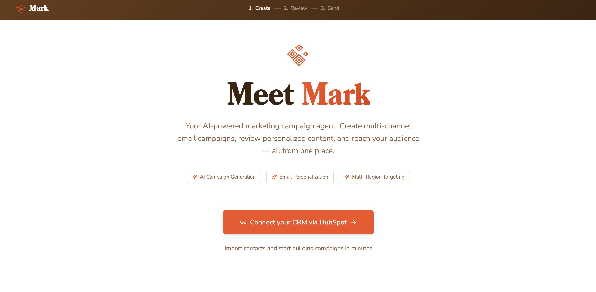

#  Mark – Multichannel Marketing AI Agent

<p align="center">
  
</p>

<p align="center">
  <strong>AI-powered campaign generation connected to your CRM.</strong><br/>
  Built during HackEurope 2026 Hackathon.
</p>

---

# 🧠 What is Mark?

**Mark** is a multichannel marketing AI agent that connects to your **Customer Relationship Management (CRM)** system and generates complete, production-ready marketing campaigns from structured prompts.

Instead of manually drafting strategy, segmentation, messaging, and structure — Mark does it for you.

It enables companies to move from:

> Raw customer data → Strategic targeting → Conversion-optimized campaigns  
in minutes.

---

# 🔗 CRM Integration

Mark is designed to integrate with CRM systems to:

- Pull customer data  
- Segment audiences dynamically  
- Personalize messaging  
- Adapt tone to customer lifecycle  
- Optimize campaigns for engagement  

This allows corporates to operationalize AI marketing directly on their own data.

---

# 🏗 Tech Stack

## Backend
- **FastAPI**
- **Python**
- **node.js**
- **HubSpot API**
- **Google Gemini API**
- **uv** (dependency management)

## Frontend
- **Vite**
- **React**
- **TypeScript**
- **Tailwind CSS**
- **shadcn-ui**

---

# 🚀 Running the Project

## 1️⃣ Install Dependencies

```bash
uv sync --all-extras
```

If you don’t have `uv` installed:
https://github.com/astral-sh/uv

---

## 2️⃣ Environment Variables

Copy the example file:

```bash
cp .env.example .env
```

Edit `.env`:

```env
GEMINI_API_KEY=your_key_here
GEMINI_MODEL=gemini-2.5-flash
GEMINI_TEMPERATURE=0.4
GEMINI_MAX_OUTPUT_TOKENS=8192
```

### Environment Variables

| Variable | Description | Default |
|-----------|------------|---------|
| GEMINI_API_KEY | Your Google Gemini API key | Required |
| GEMINI_MODEL | Gemini model version | gemini-2.5-flash |
| GEMINI_TEMPERATURE | Creativity level | 0.4 |
| GEMINI_MAX_OUTPUT_TOKENS | Max generation length | 8192 |

---

## 3️⃣ Start the Development Server

```bash
make dev
```

Backend runs at:

```
http://localhost:8000
```

Interactive API documentation:

```
http://localhost:8000/docs
```

---


# 📂 Project Structure

```
backend/
frontend/
examples/
outputs/
.env
README.md
```

---

# 🏁 Built During HackEurope Stockholm 2026

## 👥 Authors

- **[Albin Kårlin]**(https://www.linkedin.com/in/albin-k%C3%A5rlin-48b089332/)
- **[Anton Holmberg]**(https://www.linkedin.com/in/anton-holmberg-7b78b4248/)
- **[Malcolm Siljehag Alencar]**(https://www.linkedin.com/in/malcolmalencar/)
- **[Edvin Gunnarsson]**(https://www.linkedin.com/in/edvin-gunnarsson-4698b521a/)

---

# 📄 License

MIT License (or specify if different)
